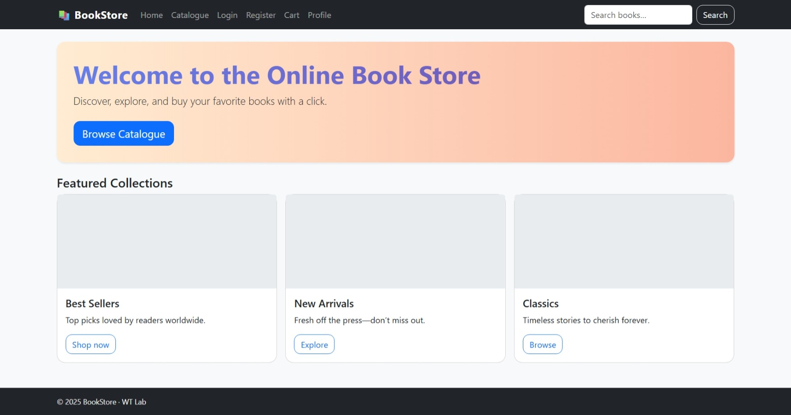
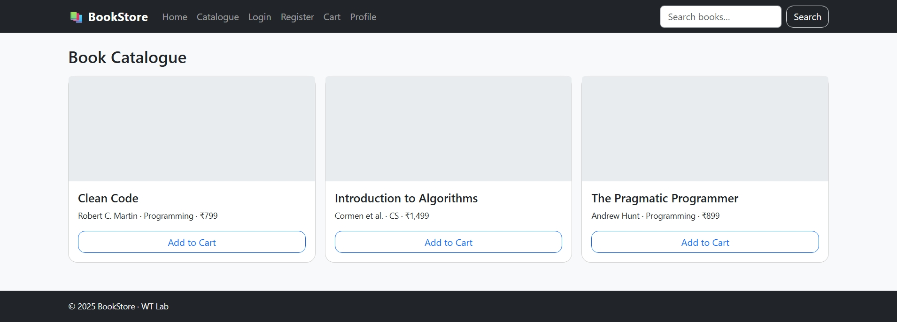
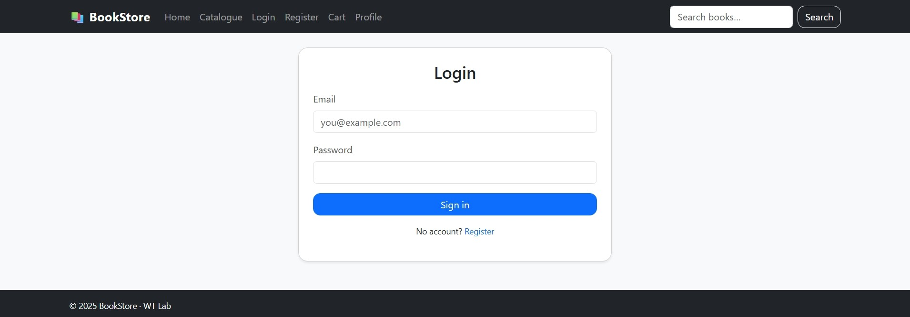
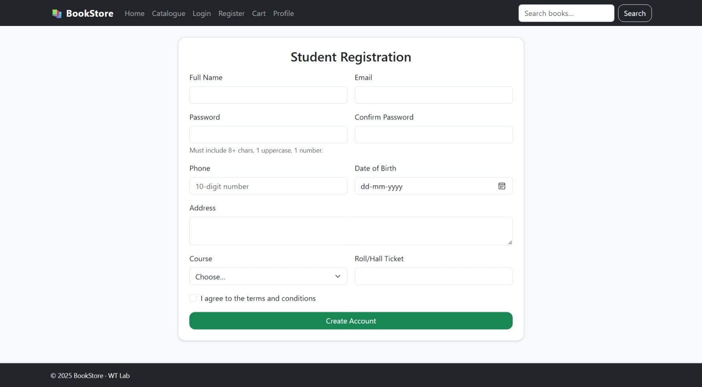
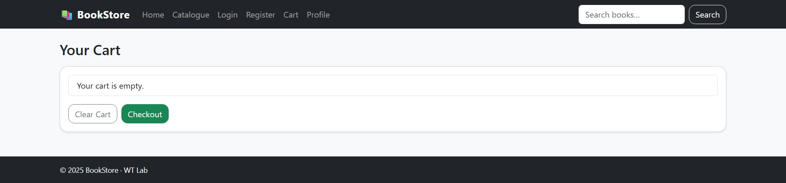
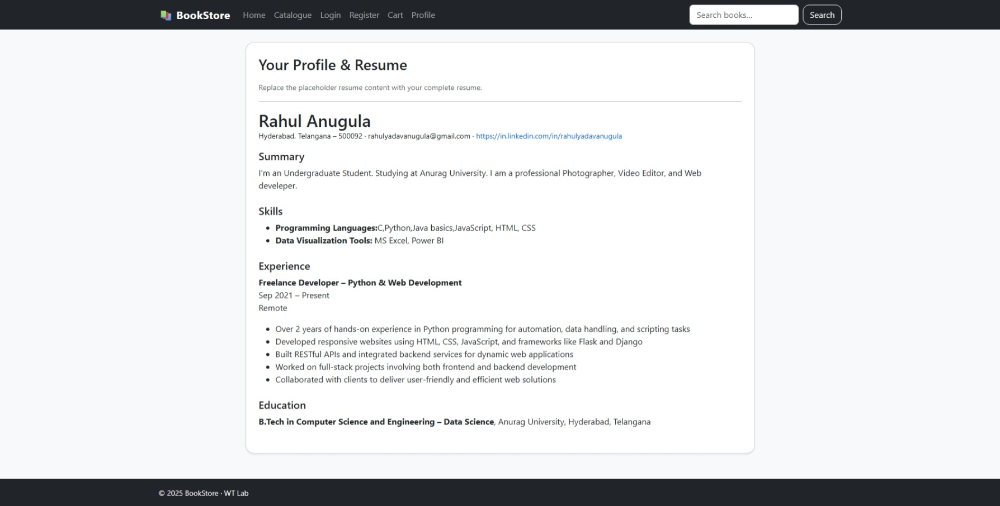

# 📚 WT Week 1–7: Online Book Store (Static Website)

This project is a **complete static website** for an **Online Book Store**, built as part of Web Technologies Lab (Weeks 1–7).  
It demonstrates **HTML, CSS, JavaScript, XML/DTD, and Bootstrap** integration.

---

## 📂 Project Contents

- **Week 1**
  - `index.html` → Home Page
  - `login.html` → Login Page (Bootstrap styled)

- **Week 2**
  - `register.html` → Student Registration Page

- **Week 3**
  - Internal CSS (inside pages)
  - External CSS: `css/styles.css`

- **Week 4**
  - JavaScript Form Validation: `js/validation.js`  
    (used in Registration Page)

- **Week 5**
  - `catalog.html` → Book Catalogue  
  - `cart.html` → Simple Shopping Cart (localStorage demo)

- **Week 6**
  - `data/books.xml` → Book Information in XML  
  - `data/books.dtd` → DTD for XML Validation

- **Week 7**
  - Bootstrap styling applied across all pages  
  - `profile.html` → Full Resume (HTML embedded)  

---
## 📸 Screenshots

### 🏠 Home Page

### 📚 Catalogue Page

### 🔑 Login Page

### 📝 Registration Page

### 🛒 Cart Page

### 🧑‍🎓 Profile Page

